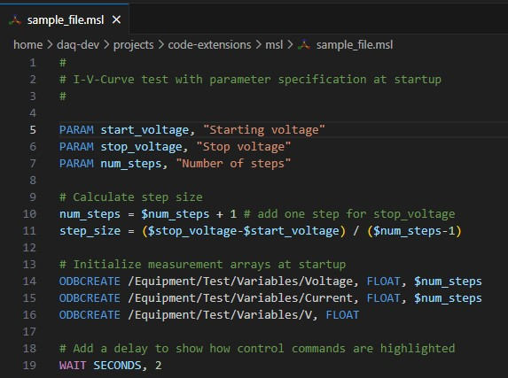

# midas-sequencer

This extension provides syntax highlighting support for the MIDAS Scripting Language (MSL). It can be installed from
[midas-sequencer-0.0.1.vsix](https://github.com/maia-hw/midas-sequencer-support/blob/main/midas-sequencer-0.0.1.vsix) by selecting "Install from VSIX" in the "Views and More Actions" (the three-dots menu) in the Extensions tab of your Visual Studio Code editor.

## Features

Syntax highlighting for all sequencer commands, and the MIDAS logo will be the file icon.

## Requirements

vscode > 1.81.0

## Future Ideas
- Add [programmatic language features](https://code.visualstudio.com/api/language-extensions/programmatic-language-features) like hovers, code completion proposals, jump to definition, or auto-formatting
- Add [semantic highlighting](https://code.visualstudio.com/api/language-extensions/semantic-highlight-guide) for functions that work with CALL
- Add [snippets](https://code.visualstudio.com/api/language-extensions/snippet-guide)
- Verify the actual minimum required version of VS Code. `"vscode": "^1.81.0"` was the default template option.

## Release Notes

### 0.0.1

Initial release
